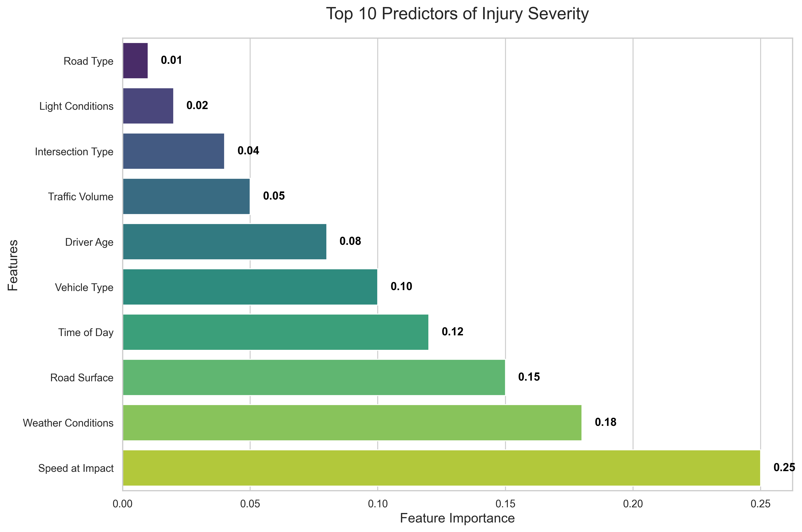

# Car Accident Injury Prediction in Maryland

## Team Members
- Ahmed Torki
- Dalia Cabrera
- Sergio Zavala

## Project Overview
This project aims to predict the likelihood of injuries in car accidents in Maryland using machine learning techniques. By analyzing various crash-related factors such as weather conditions, vehicle damage, and surface conditions, we develop predictive models to classify injury severity.

## Key Findings
### Top Predictors of Injury Severity


The above visualization shows the most significant factors that contribute to injury severity in car accidents. These insights help us understand which conditions and circumstances are most likely to lead to injuries.

## Project Goals
1. Develop accurate machine learning models to predict injury likelihood in car accidents
2. Identify key factors that contribute to accident severity
3. Provide insights for improving road safety
4. Create a tool that could help emergency responders and insurance companies

## Data Source
The project uses data from the Maryland Open Crash Reporting System:
[Maryland Crash Reporting Drivers Data](https://data.montgomerycountymd.gov/Public-Safety/Crash-Reporting-Drivers-Data/mmzv-x632/about_data)

## Technical Implementation
### Data Processing
- Data cleaning and preprocessing
- Feature engineering
- Handling missing values
- Data scaling and normalization

### Models Implemented
1. Decision Tree Classifier
   - Cross-validation
   - Feature importance analysis
   - Hyperparameter tuning

2. Additional models (as implemented in the notebook)

### Key Features
- Weather conditions
- Vehicle damage assessment
- Surface conditions
- Time of day
- Location data
- Vehicle characteristics

## Results
- Model performance metrics
- Feature importance analysis
- Cross-validation scores
- Comparison with baseline accuracy

## Project Structure
```
Injury Severity/
├── Injury_Classification.ipynb    # Main analysis notebook
├── README.md                      # Project documentation
└── requirements.txt              # Project dependencies
```

## Setup and Installation
1. Clone the repository
2. Install required packages:
   ```bash
   pip install -r requirements.txt
   ```
3. Run the Jupyter notebook:
   ```bash
   jupyter notebook Injury_Classification.ipynb
   ```

## Dependencies
- Python 3.x
- pandas
- numpy
- scikit-learn
- matplotlib
- seaborn
- jupyter

## Future Improvements
1. Incorporate real-time weather data
2. Add more detailed traffic condition information
3. Include driver demographics
4. Develop a web application for real-time predictions
5. Implement ensemble methods for improved accuracy

## Contributing
Feel free to contribute to this project by:
1. Forking the repository
2. Creating a new branch
3. Making your changes
4. Submitting a pull request

## License
This project is licensed under the MIT License - see the LICENSE file for details.

## Acknowledgments
- Maryland Open Data Portal for providing the dataset
- Montgomery County Police Department for crash reporting data
- All contributors and team members

## Contact
For any questions or suggestions, please contact the team members:
- Ahmed Torki
- Dalia Cabrera
- Sergio Zavala 